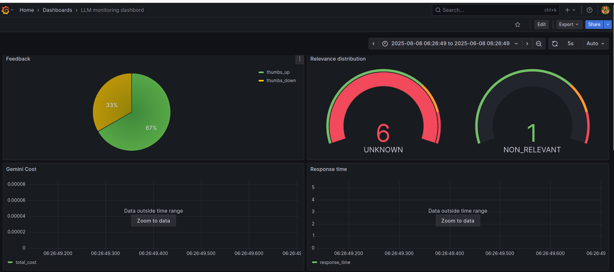

# Fitness Assistant

Note: I submitted this project too to see how many points it'd get

<p align="center">
  
</p>

Staying consistent with fitness routines is challenging,
especially for beginners. Gyms can be intimidating, and personal
trainers aren't always available.

The Fitness Assistant provides a conversational AI that helps
users choose exercises and find alternatives, making fitness more
manageable.

This project was implemented for 
[LLM Zoomcamp](https://github.com/DataTalksClub/llm-zoomcamp) -
a free course about LLMs and RAG.

<p align="center">
  
</p>

To see a demo of the project and instructions on how to run it
on github codespaces, check this video:


<p align="center">
  <a href="https://www.youtube.com/watch?v=RiQcSHzR8_E">
    
  </a>
</p>


## Project overview

The Fitness Assistant is a RAG application designed to assist
users with their fitness routines.

The main use cases include:

1. Exercise Selection: Recommending exercises based on the type
of activity, targeted muscle groups, or available equipment.
2. Exercise Replacement: Replacing an exercise with suitable
alternatives.
3. Exercise Instructions: Providing guidance on how to perform a
specific exercise.
4. Conversational Interaction: Making it easy to get information
without sifting through manuals or websites.

## Dataset

The dataset used in this project contains information about
various exercises, including:

- **Exercise Name:** The name of the exercise (e.g., Push-Ups, Squats).
- **Type of Activity:** The general category of the exercise (e.g., Strength, Mobility, Cardio).
- **Type of Equipment:** The equipment needed for the exercise (e.g., Bodyweight, Dumbbells, Kettlebell).
- **Body Part:** The part of the body primarily targeted by the exercise (e.g., Upper Body, Core, Lower Body).
- **Type:** The movement type (e.g., Push, Pull, Hold, Stretch).
- **Muscle Groups Activated:** The specific muscles engaged during
the exercise (e.g., Pectorals, Triceps, Quadriceps).
- **Instructions:** Step-by-step guidance on how to perform the
exercise correctly.

You can find the data in [`data/data.csv`](data/data.csv).

## Technologies used
* Minsearch for full text search 
* GEMINI as LLM
* Flas for API interface


## Runing it

## Running locally 
### Installing the depencies 
If you don't use docker and run locally,
you need to manually prepare the eenvironment and install all the depencies .

We use pip for managing dependencies and Python 3.12

Installing the dependencies 

```bash
pip install -r requirements.txt
```

### Run the application

For Running the Flask application locally, run this:

```bash
    python3 app.py

```
## Preparing the application

Before we can use the app, we need to initialize the database.
We can do it by running the [`db_prep.py`](fitness_assistant/db_prep.py) script:

```bash
export POSTGRES_HOST=localhost
cd fitness_assistant
python3 db_prep.py
```


### Using the application
Fist you need to start the application either with docker compose  or locally:

When it's running, let's test it:

```bash
URL="http://localhost:5000"
QUESTION="How to get a flat stomach?"
DATA='{"question":"'${QUESTION}'"}'
curl -X POST \
    -H "Content-Type: application/json" \
    -d "${DATA}" \
    ${URL}/ask 

```
You will see something like the following in the response 

```json
{
  "answer": "Based on the provided exercises, strengthening your core muscles is important for a flat stomach.  Exercises like Turkish Get-Ups and Dead Bugs directly activate the core muscles (Rectus Abdominis and Hip Flexors).  Additionally, many exercises indirectly engage the core for stabilization, such as the Sled Push and Sled Drag.\n",
  "conversation_id": "1b44a2f7-956c-4b6e-8802-bbcfa09488eb",
  "question": "How to get a flat stomach?"
}
```

Sending Feedback

```bash
URL="http://localhost:5000"
ID="76c11ac8-6b81-4435-8fe8-30e4f97c3b31"
DATA='{"conversation_id":'"${ID}"',"feedback":1}'
curl -X POST \
    -H "Content-Type: application/json" \
    -d "${DATA}" \
    ${URL}/feedback 

URL="http://localhost:5000"
ID="76c11ac8-6b81-4435-8fe8-30e4f97c3b31"
DATA='{"conversation_id":'"${ID}"',"feedback":1}'
curl -X POST \
    -H "Content-Type: application/json" \
    -d "${DATA}" \
    ${URL}/feedback

```
After sending it you'll receive the acknowledgement

```json
{
  "message": "Received feedback 1 for conversation 1b44a2f7-956c-4b6e-8802-bbcfa09488eb"
}
```
Alternatively you can use [test.py](test.py) for testing it:

```bash
python3 test.py
```

### Runing it with Docker
The easiest way to run this application is with docker 
```bash
docker compose up 
```
If you need to change something in the dockerfile and test it quickly, you can use the folowing commands:
```bash
docker build -t fitness-assistant .
```
```bash
docker run -it --rm \
    -p 5000:5000 \
    fitness-assistant
```
### Misc
You can also run the notebooks to explore the experiments

##  Code 

The code for the application is in 
[`fitness_assistant`](fitness_assistant/) folder:

- [`app.py`](fitness_assistant/app.py)
- [`ingest.py`](fitness_assistant/injest.py)
- [``rag.py](fitness_assistant/rag.py)


## Interface
We use Flask for serving the application as API. 
Refer to ["Runthe application" section](#run-the-application) for more details

## Ingestion
The ingestion script is in [fitness_assistant/ingest.py](fitness_assistant/ingest.py)
and it runs on the startup of the app (in [fitness_assistant/rag.py](fitness_assistant/rag.py))


## Evaluation

For the code for evaluating the system, you can check the [notebooks/rag-test.ipynb](notebooks/rag-test.ipynb)

### Retrieval 
The basic approach using minsearch without any boosting *- gave the following metrics:
* hit_rate: 89.66%,
* mrr: 70.20%

The improved version with better boosting gave:
* hit_rate: 93.49%, 
* mrr: 79%
The best boosting parametrs

* body_part: 0.947771590052861,
* exercise_name: 2.8439224585464493,
* instructions: 0.6987228015703881,
* muscle_groups_activated: 0.49261344050772715,
* type: 2.587600420079811,
* type_of_activity: 0.3898333128794963,
* type_of_equipment: 1.234288967556835
            

### Rag flow
We use LLM as a judge metric to evaluate the quality for RAG flow.
Dor gemini-1.5-flash Among 200 records, we had :

* 10.5% RELEVANT 
* 48% PARTIALLY_RELEVANT 
* 41.5% NON_RELEVANT 


## Monitoring

We use Grafana for monitoring the application. 

It's accessible at [localhost:3000](http://localhost:3000):

- Login: "admin"
- Password: "admin"

### Dashboards

<p align="center">
  
</p>

The monitoring dashboard contains several panels:

1. **Last 5 Conversations (Table):** Displays a table showing the five most recent conversations, including details such as the question, answer, relevance, and timestamp. This panel helps monitor recent interactions with users.
2. **+1/-1 (Pie Chart):** A pie chart that visualizes the feedback from users, showing the count of positive (thumbs up) and negative (thumbs down) feedback received. This panel helps track user satisfaction.
3. **Relevancy (Gauge):** A gauge chart representing the relevance of the responses provided during conversations. The chart categorizes relevance and indicates thresholds using different colors to highlight varying levels of response quality.
4. **OpenAI Cost (Time Series):** A time series line chart depicting the cost associated with OpenAI usage over time. This panel helps monitor and analyze the expenditure linked to the AI model's usage.
5. **Tokens (Time Series):** Another time series chart that tracks the number of tokens used in conversations over time. This helps to understand the usage patterns and the volume of data processed.
6. **Model Used (Bar Chart):** A bar chart displaying the count of conversations based on the different models used. This panel provides insights into which AI models are most frequently used.
7. **Response Time (Time Series):** A time series chart showing the response time of conversations over time. This panel is useful for identifying performance issues and ensuring the system's responsiveness.

### Setting up Grafana

All Grafana configurations are in the [`grafana`](grafana/) folder:

- [`init.py`](grafana/init.py) - for initializing the datasource and the dashboard.
- [`dashboard.json`](grafana/dashboard.json) - the actual dashboard (taken from LLM Zoomcamp without changes).

To initialize the dashboard, first ensure Grafana is
running (it starts automatically when you do `docker-compose up`).

Then run:

```bash
pipenv shell

cd grafana

# make sure the POSTGRES_HOST variable is not overwritten 
env | grep POSTGRES_HOST

python init.py
```

Then go to [localhost:3000](http://localhost:3000):

- Login: "admin"
- Password: "admin"

When prompted, keep "admin" as the new password.


## Background
Here we provide background on some tech we used and further reading

### Flask
Flask is a lightweight, open-source Python web framework designed for building web applications quickly and with minimal overhead. It provides tools for routing, handling HTTP requests, and rendering templates, making it ideal for small to medium-sized projects. Known for its simplicity and flexibility, Flask allows developers to customize and scale applications easily. 
In our case, we can send the question to `http://localhost:5000/ask"`

For more details, visit the [official Flask documentation](https://flask.palletsprojects.com/en/stable/).
